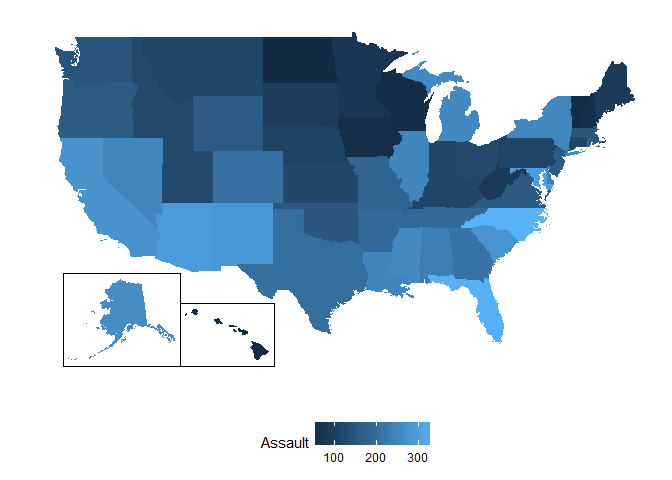

<!-- README.md is generated from README.Rmd. Please edit that file -->
fiftystater
===========

This data package provides an easy way to plot 50-state choropleths with ggplot2 in R.

The U.S. state map includes in the `maps` package includes only the 48 contiguous states. A search for solutions for fifty state thematic maps in R will lead to Stack OVerflow threads ([1](http://stackoverflow.com/questions/13757771/), [2](http://stackoverflow.com/questions/25530358/)), but the solutions available require either limiting ggplot2 options by rendering with a specific package, installing a large list of dependencies and tracking down shapefiles to perform arcane transformation calculations, or using annotations or visibility-based maps that compromise the aesthetic of the vizualization.

In this package, I have followed the steps in an [answer from Barry Rowlingson](http://stackoverflow.com/a/13767984) to transform Alaska and Hawaii into insets next to the contiguous states and pacakged the resulting data frame for simple drop-in use.

Installation
------------

You can install fiftystater from github with:

``` r
# install.packages("devtools")
devtools::install_github("wmurphyrd/fiftystater")
```

Example
-------

To use the fifty state map, simply point the `map` argument in `geom_map` to `fifty_states`. As usual, you'll also create an aesthetic mapping for map\_id to the column in your data frame that contains the lower case state names.

``` r
library(ggplot2)
library(fiftystater)

data("fifty_states") # this line is optional due to lazy data loading

crimes <- data.frame(state = tolower(rownames(USArrests)), USArrests)

p <- ggplot(crimes, aes(map_id = state)) +
  geom_map(aes(fill = Assault), map = fifty_states) +
  expand_limits(x = fifty_states$long, y = fifty_states$lat) +
  coord_map() +
  scale_x_continuous(breaks = NULL) + 
  scale_y_continuous(breaks = NULL) +
  labs(x = "", y = "") +
  theme(legend.position = "bottom", 
        panel.background = element_blank())

p
```


If you need to be very technicallty accurate, you can add bounding boxes to highlight the inset so that no viewer confuses Alaska and Hawaii for regions in Mexico that you randomly decided to include. I've packaged those up in a `layer` object called `fifty_states_inset_boxes` (created via `annotate`), so you can just add it to your plot.

``` r
# add border boxes to AK/HI
p + fifty_states_inset_boxes 
```


