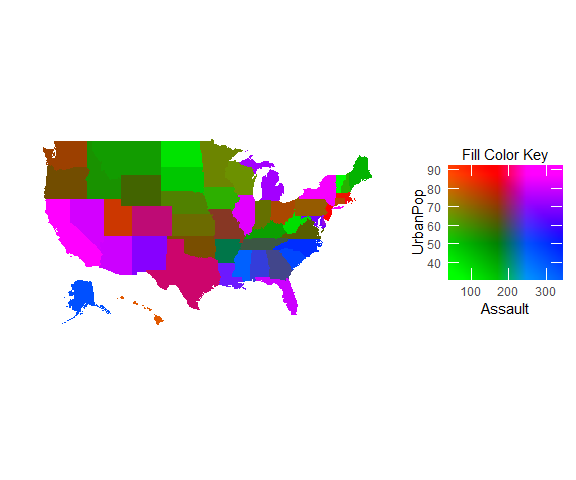

<!-- README.md is generated from README.Rmd. Please edit that file -->
fiftystater
===========

[](https://cran.r-project.org/package=fiftystater) [](https://travis-ci.org/wmurphyrd/fiftystater)

This data package provides an easy way to plot 50-state choropleth thematic maps with ggplot2 in R.

Motivation
----------

It is far too difficult to create a U.S. state data visualization in R that includes Alaska and Hawaii. The U.S. state map included in the `maps` package includes only the 48 contiguous states. A search for existing solutions will lead to Stack Overflow threads ([1](http://stackoverflow.com/questions/13757771/), [2](http://stackoverflow.com/questions/25530358/)), but the solutions available require either limiting plotting options by rendering with a specific package, installing a large list of dependencies and tracking down shape files to perform arcane transformation calculations, or using annotations or visibility-based maps that compromise the aesthetic of the visualization.

This package is a simple solution: a data file, with no dependencies, that can be dropped into ggplot2 with no effort. To create it, I followed the steps in a [Stack Overflow answer](http://stackoverflow.com/a/13767984) from Barry Rowlingson to transform Alaska and Hawaii into insets next to the contiguous states and packaged the resulting data frame for simple drop-in use.

Installation
------------

You can install fiftystater from github with:

``` r
# install.packages("devtools")
devtools::install_github("wmurphyrd/fiftystater")
```

Usage Examples
--------------

To use the fifty state map, simply point the `map` argument in `geom_map` to `fifty_states`. As usual, you'll also create an aesthetic mapping for `map_id` to the column in your data frame that contains the lower case state names.

``` r
library(ggplot2)
library(fiftystater)

data("fifty_states") # this line is optional due to lazy data loading

crimes <- data.frame(state = tolower(rownames(USArrests)), USArrests)

# map_id creates the aesthetic mapping to the state name column in your data
p <- ggplot(crimes, aes(map_id = state)) + 
  # map points to the fifty_states shape data
  geom_map(aes(fill = Assault), map = fifty_states) + 
  expand_limits(x = fifty_states$long, y = fifty_states$lat) +
  coord_map() +
  scale_x_continuous(breaks = NULL) + 
  scale_y_continuous(breaks = NULL) +
  labs(x = "", y = "") +
  theme(legend.position = "bottom", 
        panel.background = element_blank())

p
```


If you need to be highly technically accurate, you can add bounding boxes to highlight the insets so that no viewer confuses Alaska and Hawaii for regions in a deformed Mexico that you randomly decided to include. I've packaged those up in a `layer` object called `fifty_states_inset_boxes` (created via `annotate`), so you can just add it to your plot.

``` r
# add border boxes to AK/HI
p + fifty_states_inset_boxes 
```


This package also plays nicely with my [colorplaner](https://cran.r-project.org/package=colorplaner) package for bivariate color scales.

``` r
# Map a second variable to each state's fill color with colorplaner
library(colorplaner)
p + aes(fill2 = UrbanPop) + scale_fill_colorplane() +
  theme(legend.position = "right")
```



The map data included in this package can be generated with the code below. If you want to run this code, you will need to ensure the packages listed below are installed; they are not automatically installed with `fiftystater`.

``` r
# Create map data with AK, HI inset.
library(maptools)
library(rgeos)
library(rgdal)
library(dplyr)

transform_state <- function(object, rot, scale, shift){
  object %>% elide(rotate = rot) %>%
    elide(scale = max(apply(bbox(object), 1, diff)) / scale) %>%
    elide(shift = shift)
}

#state shape file from
# http://www.arcgis.com/home/item.html?id=f7f805eb65eb4ab787a0a3e1116ca7e5
loc <- file.path(tempdir(), "stats_dat")
unzip(system.file("extdata", "states_21basic.zip", package = "fiftystater"),
      exdir = loc)
fifty_states_sp <- readOGR(dsn = loc, layer = "states", verbose = FALSE) %>%
  spTransform(CRS("+init=epsg:2163"))

alaska <- fifty_states_sp[fifty_states_sp$STATE_NAME == "Alaska", ] %>%
  transform_state(-35, 2.5, c(-2400000, -2100000))
proj4string(alaska) <- proj4string(fifty_states_sp)

hawaii <- fifty_states_sp[fifty_states_sp$STATE_NAME == "Hawaii", ] %>%
  transform_state(-35, .75, c(-1170000,-2363000))
proj4string(hawaii) <- proj4string(fifty_states_sp)

fifty_states <-
  fifty_states_sp[!fifty_states_sp$STATE_NAME %in% c("Alaska","Hawaii"), ] %>%
  rbind(alaska) %>%
  rbind(hawaii) %>%
  spTransform(CRS("+init=epsg:4326")) %>%
  fortify(region = "STATE_NAME") %>%
  mutate(id = tolower(id))
```
